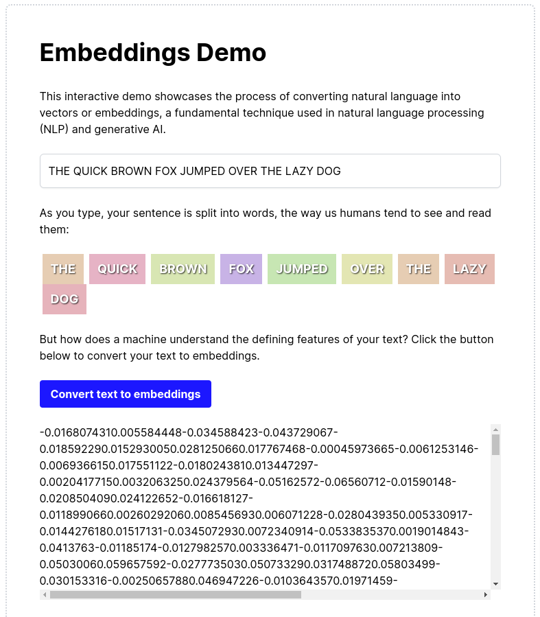

# Embeddings Demo 

### Understand how data is converted to embeddings



### Built With

- Next.js + tailwind
- OpenAI's `text-embedding-3-small` model
- Node version 20 or higher

---

### Start the project

**Requires Node version 20+**

From the project root directory, run the following command.

```bash
npm install
```

### Set environment variables

Make sure you have populated a `.env.local` file with your OpenAI API key: 

```
OPENAI_API_KEY="your_openai_api_key_here"
```

Start the app.

```bash
npm run dev
```

## Project structure

In this example we opted to use Next.js and the app router, which colocates the frontend and backend code in a single repository.

**Frontend Client**

The frontend uses Next.js and tailwind to allow users to enter free form text. This text is split by word on the client-side and then converted to tokens by the `tiktoken` library 
when the user clicks the `Convert text to embeddings` button. 

OpenAI's `text-embedding-3-small` model extracts the features of the text you provide it and returns vectors representing these features. 

**Backend API route**

This project exposes an API route: `/api/embeddings`: 

```typescript
import { NextRequest, NextResponse } from 'next/server';
import OpenAI from 'openai';

const openai = new OpenAI({
  apiKey: process.env.OPENAI_API_KEY,
});

export async function POST(req: NextRequest) {
  const { inputText } = await req.json();

  try {
    const response = await openai.embeddings.create({
      model: 'text-embedding-3-small',
      input: inputText,
    });

    const generatedEmbeddings = response.data[0].embedding;
    console.log(`Generated embeddings: %o`, generatedEmbeddings);

    return NextResponse.json({ embeddings: generatedEmbeddings }, { status: 200 });
  } catch (error) {
    console.error('Error generating embeddings:', error);
    return NextResponse.json({ error }, { status: 500 });
  }
}
```
